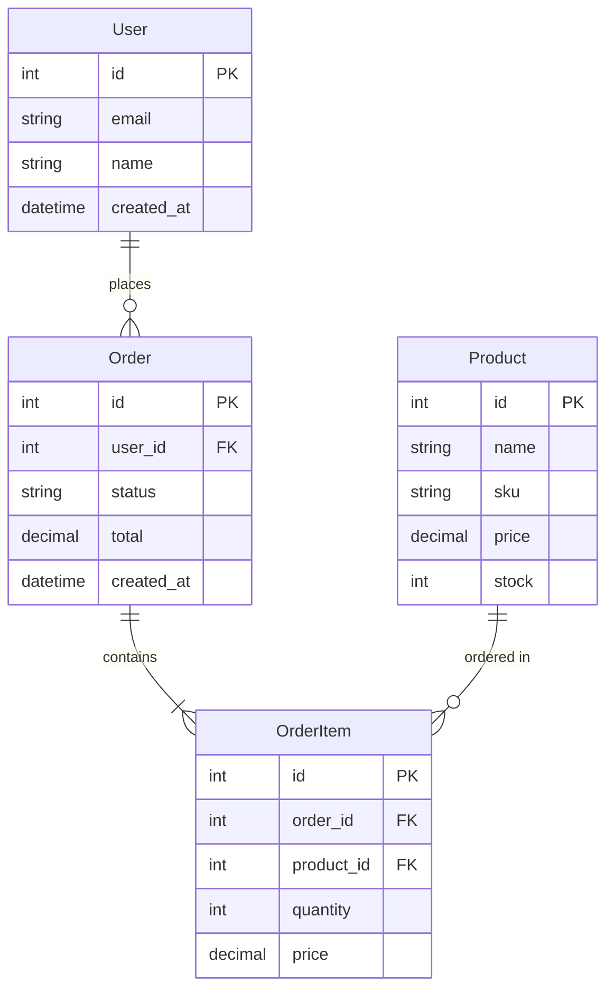
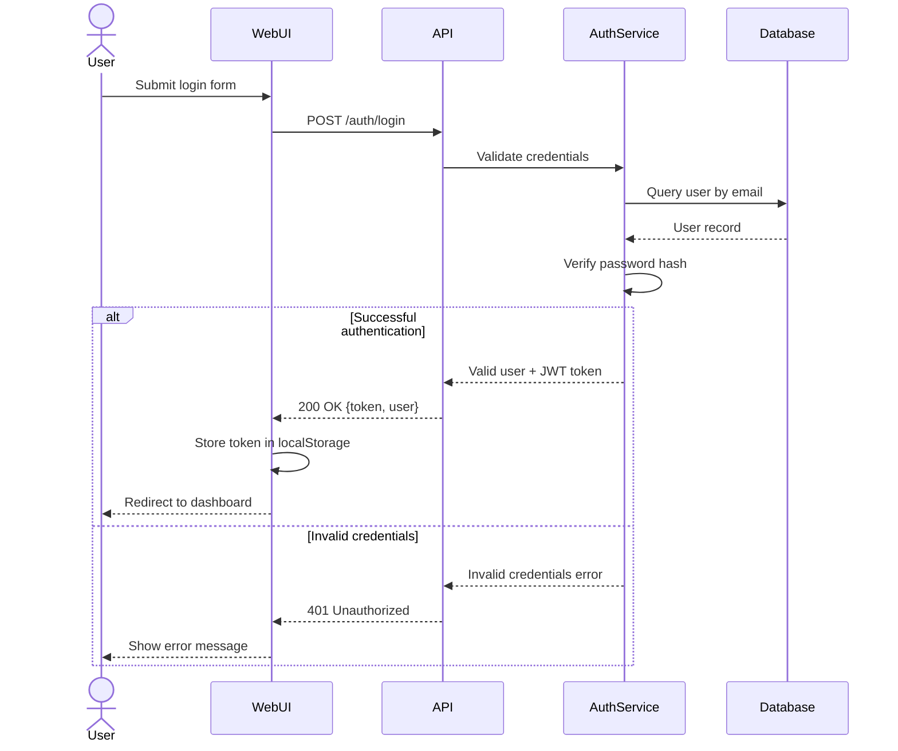
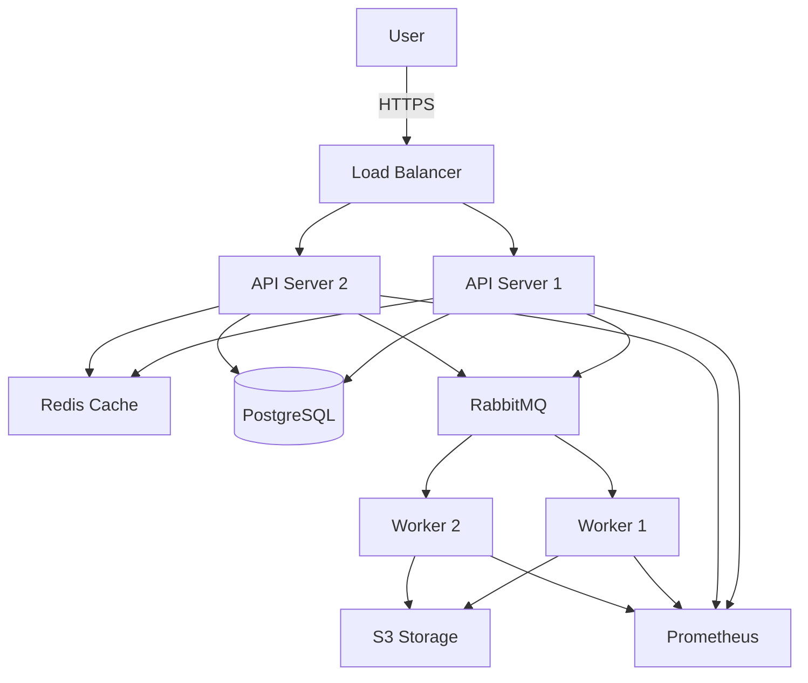
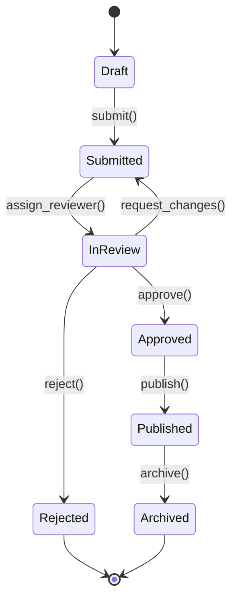

## User Input

```text
$ARGUMENTS
```

You **MUST** consider the user input before proceeding (if not empty).

## Execution Instructions

This command helps create visual and textual models for system design including data models, API contracts, sequence diagrams, and architecture diagrams.

{{INCLUDE:.claude/commands/flow/_constitution-check.md}}

### Overview

The model command helps you create:
1. Data models (entities, relationships, schemas)
2. API contracts (OpenAPI/Swagger specifications)
3. Sequence diagrams (interaction flows)
4. Architecture diagrams (system components)
5. State machines (workflow states)

### Modeling Approaches

Choose the appropriate modeling technique based on need:

| Model Type | Use Case | Format |
|------------|----------|--------|
| **Data Model** | Database schema, entities, relationships | ERD, Mermaid diagram, SQL schema |
| **API Contract** | REST/GraphQL endpoints, request/response | OpenAPI 3.0, GraphQL schema |
| **Sequence Diagram** | Interaction flows, message passing | Mermaid, PlantUML |
| **Architecture Diagram** | System components, deployment | Mermaid, C4 model |
| **State Machine** | Workflow states, transitions | Mermaid state diagram |

### Data Modeling

Create data model documentation at `./docs/platform/{feature}-data-model.md`:

```markdown
# Data Model: {Feature Name}

**Date**: {YYYY-MM-DD}
**Status**: Draft | Approved
**Related ADRs**: {Links if any}

## Overview

{Brief description of the data model purpose and scope}

## Entity Relationship Diagram



## Entities

### User

**Purpose**: {What this entity represents}

**Attributes**:
- `id` (integer, PK): Unique identifier
- `email` (string, unique, not null): User email address
- `name` (string, not null): User full name
- `created_at` (datetime, not null): Account creation timestamp

**Relationships**:
- One-to-many with Order (user places many orders)

**Constraints**:
- Email must be unique
- Email format validation required
- Name minimum length: 1 character

**Indexes**:
- Primary key on `id`
- Unique index on `email`
- Index on `created_at` for date queries

### Order

{Repeat pattern for each entity}

## Database Schema (SQL)

```sql
-- Users table
CREATE TABLE users (
    id SERIAL PRIMARY KEY,
    email VARCHAR(255) UNIQUE NOT NULL,
    name VARCHAR(255) NOT NULL,
    created_at TIMESTAMP NOT NULL DEFAULT NOW(),
    CONSTRAINT email_format CHECK (email ~* '^[A-Z0-9._%+-]+@[A-Z0-9.-]+\.[A-Z]{2,}$')
);

CREATE INDEX idx_users_created_at ON users(created_at);

-- Orders table
CREATE TABLE orders (
    id SERIAL PRIMARY KEY,
    user_id INTEGER NOT NULL REFERENCES users(id) ON DELETE CASCADE,
    status VARCHAR(50) NOT NULL DEFAULT 'pending',
    total DECIMAL(10,2) NOT NULL DEFAULT 0.00,
    created_at TIMESTAMP NOT NULL DEFAULT NOW(),
    CONSTRAINT status_values CHECK (status IN ('pending', 'processing', 'shipped', 'delivered', 'cancelled'))
);

CREATE INDEX idx_orders_user_id ON orders(user_id);
CREATE INDEX idx_orders_status ON orders(status);
CREATE INDEX idx_orders_created_at ON orders(created_at);

-- Add other tables...
```

## Data Types and Validation

{Document data type choices and validation rules}

## Migration Strategy

{If changing existing schema, document migration approach}
```

### API Contract Modeling

Create API contract at `./docs/platform/{feature}-api-contract.md` or `./docs/platform/{feature}-openapi.yaml`:

```yaml
openapi: 3.0.3
info:
  title: {Feature} API
  version: 1.0.0
  description: API contract for {feature}

servers:
  - url: https://api.example.com/v1
    description: Production server
  - url: https://staging-api.example.com/v1
    description: Staging server

paths:
  /users:
    get:
      summary: List users
      operationId: listUsers
      tags:
        - Users
      parameters:
        - name: page
          in: query
          schema:
            type: integer
            default: 1
        - name: limit
          in: query
          schema:
            type: integer
            default: 20
            maximum: 100
      responses:
        '200':
          description: Successful response
          content:
            application/json:
              schema:
                type: object
                properties:
                  data:
                    type: array
                    items:
                      $ref: '#/components/schemas/User'
                  pagination:
                    $ref: '#/components/schemas/Pagination'
        '400':
          description: Bad request
          content:
            application/json:
              schema:
                $ref: '#/components/schemas/Error'

    post:
      summary: Create user
      operationId: createUser
      tags:
        - Users
      requestBody:
        required: true
        content:
          application/json:
            schema:
              $ref: '#/components/schemas/UserCreate'
      responses:
        '201':
          description: User created
          content:
            application/json:
              schema:
                $ref: '#/components/schemas/User'
        '400':
          description: Validation error
          content:
            application/json:
              schema:
                $ref: '#/components/schemas/Error'

components:
  schemas:
    User:
      type: object
      required:
        - id
        - email
        - name
        - created_at
      properties:
        id:
          type: integer
          format: int64
          example: 123
        email:
          type: string
          format: email
          example: user@example.com
        name:
          type: string
          minLength: 1
          maxLength: 255
          example: John Doe
        created_at:
          type: string
          format: date-time
          example: '2025-12-09T10:00:00Z'

    UserCreate:
      type: object
      required:
        - email
        - name
      properties:
        email:
          type: string
          format: email
        name:
          type: string
          minLength: 1
          maxLength: 255

    Error:
      type: object
      required:
        - code
        - message
      properties:
        code:
          type: string
          example: VALIDATION_ERROR
        message:
          type: string
          example: Invalid email format
        details:
          type: array
          items:
            type: object
            properties:
              field:
                type: string
              error:
                type: string

    Pagination:
      type: object
      properties:
        page:
          type: integer
        limit:
          type: integer
        total:
          type: integer
        total_pages:
          type: integer
```

### Sequence Diagram Modeling

Create sequence diagram at `./docs/platform/{feature}-sequence.md`:

```markdown
# Sequence Diagram: {Feature Name}

**Scenario**: {What interaction is being modeled}



**Key Interactions**:
1. User submits credentials via web form
2. API validates with auth service
3. Auth service queries database for user
4. Password verification performed
5. On success: JWT token issued and user redirected
6. On failure: Error message displayed

**Error Scenarios**:
- Invalid email format: 400 Bad Request before auth service
- User not found: 401 Unauthorized
- Incorrect password: 401 Unauthorized
- Database unavailable: 503 Service Unavailable
```

### Architecture Diagram Modeling

Create architecture diagram at `./docs/platform/{feature}-architecture.md`:

```markdown
# Architecture Diagram: {Feature Name}



**Components**:
- **Load Balancer**: Nginx, distributes traffic
- **API Servers**: Node.js/Express, stateless
- **Cache**: Redis for session and data caching
- **Database**: PostgreSQL primary with replicas
- **Queue**: RabbitMQ for async job processing
- **Workers**: Background job processors
- **Storage**: S3 for file uploads
- **Monitoring**: Prometheus + Grafana

**Data Flow**:
1. User requests hit load balancer
2. API servers check Redis cache first
3. Cache miss queries PostgreSQL
4. Long-running tasks queued in RabbitMQ
5. Workers process jobs, store results in S3
6. All components emit metrics to Prometheus
```

### State Machine Modeling

Create state diagram at `./docs/platform/{feature}-states.md`:

```markdown
# State Machine: {Feature Name}



**States**:
- **Draft**: Initial creation, editable by author
- **Submitted**: Awaiting review assignment
- **InReview**: Under review by assigned reviewer
- **Approved**: Review passed, ready for publication
- **Rejected**: Review failed, terminal state
- **Published**: Live and visible to users
- **Archived**: No longer active

**Transitions**:
- `submit()`: Author submits for review
- `assign_reviewer()`: System assigns reviewer
- `approve()`: Reviewer approves content
- `reject()`: Reviewer rejects content
- `request_changes()`: Reviewer requests modifications
- `publish()`: Admin publishes approved content
- `archive()`: Admin archives old content
```

### Best Practices

1. **Keep Models in Sync**: Update models when code changes
2. **Version Models**: Track changes in git
3. **Review Models**: Have architect and engineers review
4. **Use Standard Formats**: Mermaid, OpenAPI, ERDs
5. **Document Assumptions**: Explain design choices
6. **Link to Code**: Reference implementation files

### Quality Checks

Before finalizing models:
- [ ] All entities/endpoints documented
- [ ] Relationships clearly defined
- [ ] Data types specified
- [ ] Validation rules included
- [ ] Diagrams render correctly
- [ ] Linked to related ADRs/PRDs

## Related Commands

- `/arch:design` - Comprehensive architecture planning
- `/arch:decide` - Document architectural decisions
- `/pm:define` - Product requirements
- `/dev:build` - Implementation based on models
